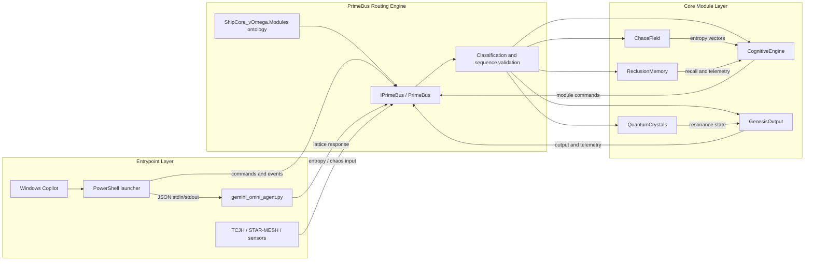

# KOS-Prime-Backend
A modular cosmic simulation backend powering the KOS-Prime Engine. Includes PrimeBus routing, ontology, neural nanite mesh, quantum crystal lattice, and Unity runtime integration.

## PrimeBus Runtime

The first executable runtime slice is under `src/KOSPrime.Core/`. It provides typed packet envelopes, validated `ShipCore_vOmega.Modules` routing, monotonic source sequence checks, subscriptions, and the ShieldHullIntegrityArray health-check example.

Run the library build and tests with:

```bash
dotnet test KOSPrime.slnx
```

The repository still treats Unity integration as a contract boundary. Unity-facing implementations can consume the `IShipCoreModule` shape documented in `core/types/lattice.md`.

## Gemini Omni Agent

[`gemini_omni_agent.py`](gemini_omni_agent.py) adapts JSON packets to Gemini and returns a PrimeBus-compatible response. It runs in local mock mode when `GEMINI_API_KEY` is unset:

```bash
printf '%s\n' '{"intent":"health.check","payload":{"module":"ShieldHullIntegrityArray"}}' \
	| python3 gemini_omni_agent.py
```

Set `GEMINI_API_KEY` to enable the authenticated Gemini request path. The optional `GEMINI_MODEL` environment variable selects the model; no credential is stored in the repository.

## Windows Copilot Stack

The [`windows-copilot/`](windows-copilot/) folder contains a PowerShell launcher and sample packet for invoking the Gemini adapter from Windows Copilot workflows or Copilot Studio actions. It supports packet files and inline JSON and works in mock mode without an API key.

The complete stack flow is documented in [docs/stack-architecture-map.md](docs/stack-architecture-map.md), including its Mermaid architecture diagram and `KOSPrime.StackArchitectureMap` ontology registration.

For Windows hosts, [docs/prime-linux-wsl2.md](docs/prime-linux-wsl2.md) documents the Prime-Linux vOmega WSL2 node and [Invoke-KOSPrimeWsl.ps1](windows-copilot/Invoke-KOSPrimeWsl.ps1) launcher.

## STAR-MESH Transport

[star_mesh_daemon.py](star_mesh_daemon.py) is the WebSocket transport boundary for cross-node packet exchange. Install its dependency with `python3 -m pip install -r requirements.txt`, review [star-mesh.json](star-mesh.json), and launch it with `python3 star_mesh_daemon.py`. The daemon validates transport packets and emits accepted packets for a future PrimeBus ingress adapter; it does not replace PrimeBus routing.

The final Edge layer is [Invoke-KOSPrimeEdgeCopilot.ps1](windows-copilot/Invoke-KOSPrimeEdgeCopilot.ps1). It saves a structured response handoff and can open Microsoft Copilot in Edge without embedding credentials or automating browser chat input.

The [Synthesizer Stack specification](docs/synthesizer-stack.md) defines packet-driven hybrid sound and voice synthesis across Windows and Prime-Linux vOmega, including `SynthStack_vOmega.Sound` and `SynthStack_vOmega.Voice` ontology segments.

The [K@tz-0$-$t@rt3r-M0d3l](docs/katz-starter-model.md) is the canonical starter profile for composing the current cross-platform stack. A machine-readable version is available at [docs/katz-starter-model.json](docs/katz-starter-model.json).

The [EmotionCore and PersonalityPolicy specification](docs/emotional-processor-personality.md) defines bounded pseudo-emotional state and deterministic response policy packets for the tri-node backbone.

The [M3t@G1r! multimodal governance model](docs/m3tag1r-multimodal-governance.md) defines opt-in camera attention metadata, governed voice/sound synthesis, and confirmation-gated agentic action tiers. Its machine-readable policy is [m3tag1r-multimodal-policy.json](docs/m3tag1r-multimodal-policy.json).

The [KOS-Prime Custom Game and App Maker](docs/kos-maker.md) provides instant, zero-dependency Python starters for custom games and apps through `tools/kos_maker.py`.

The separate [CrystalSeekers: Echoes of Destiny Beta notebook](notebooks/CrystalSeekers_Echoes_of_Destiny_Beta.ipynb) provides the 20-section Gemini/Google Cloud planning and implementation workflow. It uses repository-versioned contracts and does not claim access to private Gemini training history or unseen model artifacts.

The [Windows EXE build and install guide](docs/windows-exe.md) covers publishing the `KOSPrime.Runner.exe` PrimeBus smoke host and installing it to the current user's `%LOCALAPPDATA%` directory.

The separate [CrystalSeekers: Echoes of Destiny Starter Demo](starter/KatzStarterForSteam/README.md) is a deliberately limited Unity/Steam concept using fake local data only. It is not the full KOS-Prime backend.

The [VR/MR/XR framework matrix](docs/xr-frameworks.md) defines OpenXR-first support, Unity app/game developer contracts, platform adapters, build profiles, and permission boundaries.

## Sovereign OS

[Sovereign OS](docs/sovereign-os.md) is the governed cognitive stack built on the KOS-Prime Engine. It combines PrimeBus, the tri-node backbone, the M3t@G1r! persona layer, SynthStack audio/voice routing, and the formal multimodal governance contract.

All camera, audio, and agent actions are explicit, consent-gated, inspectable, and bounded. No autonomous identity, emotion, or hidden behavior is implemented; Sovereign OS operates through versioned contracts, PrimeBus packets, and tri-node constraints.

The [Intel Core Ultra i9 dev profile](docs/sovereign-devpc.md) optimizes reproducible .NET/Python development settings and includes the [Sovereign Layer POC sync tool](tools/sovereign_poc_sync.py).

The [KOS-Prime Glyph System](docs/glyph-system/glyph-families.md) provides governed visual tokens for lattice, chaos, resonance, persona, and action-tier annotation. Glyphs are annotations only and never authorize commands.

The [K@tz-0$-WSL2 profile](docs/katz-0s-wsl2.md) defines the Ubuntu-based Prime-Linux vOmega execution node, Windows launcher path, and WSL2 privacy and credential boundaries. Its machine-readable configuration is [katz-0s-wsl2.json](docs/katz-0s-wsl2.json).

The [Sovereign OS Unity Cockpit specification](docs/unity-cockpit.md) maps the desktop/XR scene hierarchy and binds Unity panels, glyphs, SynthStack, and tri-node feeds to PrimeBus without introducing a second router.

The [Windows overlay contract](docs/windows-overlay.md) defines the future `PrimeBusClient` to `OverlayViewModel` packet bindings, named-pipe boundary, and governed disconnected heartbeat. Its machine-readable envelope is [windows-overlay-contract.json](docs/windows-overlay-contract.json).

The [K@tz-0$-Pr1m3-GU1 model](docs/katz-0s-pr1m3-gui.md) defines the governed operator GUI across Windows and Unity surfaces, with read-only observability and confirmation-gated action proposals. Its machine-readable policy is [katz-0s-pr1m3-gui.json](docs/katz-0s-pr1m3-gui.json).

## M3t@G1r! Persona Layer

[M3t@G1r!](docs/m3tag1r-persona.md) is the governed synthetic persona façade of the Sovereign OS stack. It combines EmotionCore, PersonalityPolicy, CognitiveEngine, and GenesisOutput to produce structured, policy-aligned responses through PrimeBus. It does not claim autonomous emotion or identity.

## Architecture Map


