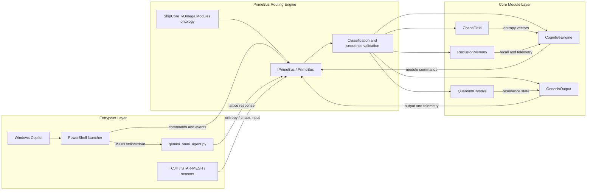

# KOS-Prime-Backend
A modular cosmic simulation backend powering the KOS-Prime Engine. Includes PrimeBus routing, ontology, neural nanite mesh, quantum crystal lattice, and Unity runtime integration.

## PrimeBus Runtime

The first executable runtime slice is under `src/KOSPrime.Core/`. It provides typed packet envelopes, validated `ShipCore_vOmega.Modules` routing, monotonic source sequence checks, subscriptions, and the ShieldHullIntegrityArray health-check example.

Run the library build and tests with:

```bash
dotnet test KOSPrime.slnx
```

The repository still treats Unity integration as a contract boundary. Unity-facing implementations can consume the `IShipCoreModule` shape documented in `core/types/lattice.md`.

## Gemini Omni Agent

[`gemini_omni_agent.py`](gemini_omni_agent.py) adapts JSON packets to Gemini and returns a PrimeBus-compatible response. It runs in local mock mode when `GEMINI_API_KEY` is unset:

```bash
printf '%s\n' '{"intent":"health.check","payload":{"module":"ShieldHullIntegrityArray"}}' \
	| python3 gemini_omni_agent.py
```

Set `GEMINI_API_KEY` to enable the authenticated Gemini request path. The optional `GEMINI_MODEL` environment variable selects the model; no credential is stored in the repository.

## Windows Copilot Stack

The [`windows-copilot/`](windows-copilot/) folder contains a PowerShell launcher and sample packet for invoking the Gemini adapter from Windows Copilot workflows or Copilot Studio actions. It supports packet files and inline JSON and works in mock mode without an API key.

The complete stack flow is documented in [docs/stack-architecture-map.md](docs/stack-architecture-map.md), including its Mermaid architecture diagram and `KOSPrime.StackArchitectureMap` ontology registration.

## Architecture Map


