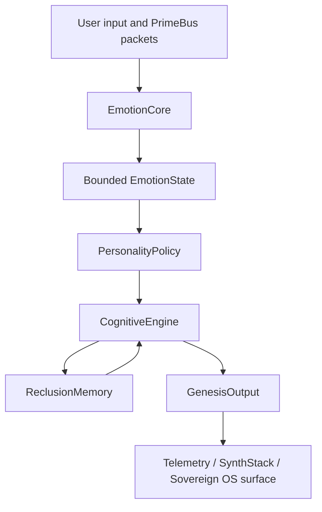

# Emotional Processor and Personality Layer

## `KOSPrime.EmotionState`

EmotionCore produces a bounded pseudo-emotional state from observable text, intent, packet, session, and telemetry features. The state is explicit, versioned, logged, and inspectable. It must never be described or stored as evidence of subjective feelings.

## `KOSPrime.PersonalityPolicy`

PersonalityPolicy applies a stable trait profile and role contract to the current EmotionState. The result is an output policy for detail, tone, topic depth, challenge, and formatting. Policy constraints are inspectable and subordinate to system, safety, and user instructions.

## PrimeBus packet contracts

| Packet | Type | Producer | Consumers |
| --- | --- | --- | --- |
| `KOSPrime.Emotion.State` | `lattice` | EmotionCore | CognitiveEngine, PersonalityPolicy, ReclusionMemory |
| `KOSPrime.Personality.Policy` | `lattice` or `xr-frame` | PersonalityPolicy | CognitiveEngine, GenesisOutput |

Both packets require a schema version, correlation ID, timestamp, source, destination, and monotonic sequence when represented as a C# `PacketEnvelope`. Raw text should remain at the entrypoint boundary unless a retention policy explicitly permits storage.

## Tri-node flow

## Governance rules

- EmotionCore is a bounded signal processor, not a claim of sentience.
- PersonalityPolicy is deterministic and versioned for a fixed profile and input state.
- PrimeBus is the only route between these modules and the tri-node backbone.
- ReclusionMemory stores state and policy references according to explicit retention rules.
- GenesisOutput emits correlation-preserving telemetry for policy decisions and final formatting.
- Trait changes require a profile version update and regression review.