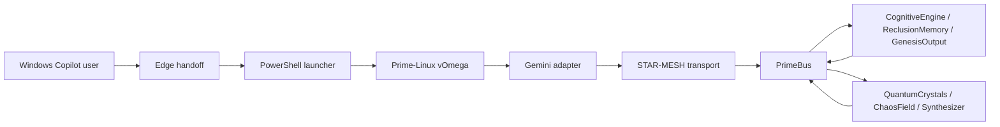

# K@tz-0$-$t@rt3r-M0d3l

Version: `1.0.0`

The K@tz-0$-$t@rt3r-M0d3l is the smallest coherent operating profile for the KOS-Prime stack. It is a composition of existing contracts, not a new runtime module or a new packet bus.

## Purpose

Provide a predictable baseline for local development, Windows/Copilot handoff, WSL2 execution, packet routing, transport, and future sound/voice synthesis integration.

## Runtime Profile

| Layer | Selected component | Role |
| --- | --- | --- |
| Host entrypoint | Windows Copilot and PowerShell | Accept commands and create JSON packet handoffs. |
| Linux execution | Prime-Linux vOmega / WSL2 | Run Python adapters and transport services. |
| Model adapter | `gemini_omni_agent.py` | Produce structured mock or live Gemini responses. |
| Transport | STAR-MESH | Exchange and filter WebSocket packets. |
| Router | `KOSPrime.Bus.PrimeBus` | Validate ontology, endpoints, and source sequence ordering. |
| State domains | QuantumCrystals and ChaosField | Supply lattice, resonance, entropy, and chaos state. |
| Backbone | CognitiveEngine, ReclusionMemory, GenesisOutput | Decide, recall, synthesize, and emit telemetry. |
| Audio contract | Synthesizer Stack | Define sound and voice packet boundaries without requiring an engine. |

## Default Flow



## Invariants

- PrimeBus is the only ontology router.
- STAR-MESH is transport only and must not dispatch modules.
- Every cross-stage packet uses an ontology segment, packet type, source, destination, timestamp, and monotonic sequence when represented in C#.
- Correlation IDs connect entrypoint intent to module state, output, audio artifacts, and telemetry.
- Modules communicate through contracts and packets, not direct module references.
- Mock mode is the default for local Gemini operation; live model access requires an environment-provided API key.
- The five ShipCore internal modules remain the complete Core Internal Modules list.

## Local Acceptance Checks

```bash
python3 -m py_compile gemini_omni_agent.py star_mesh_daemon.py
python3 -m json.tool star-mesh.json >/dev/null
dotnet test KOSPrime.slnx
```

The Windows-specific launchers should additionally be exercised on a Windows host with PowerShell and, where configured, WSL2 Ubuntu.

## Maturity Boundary

Implemented baseline: typed PrimeBus routing, ShieldHullIntegrityArray health checks, Gemini mock/live adapter, STAR-MESH inbound transport validation, Windows/WSL2 launchers, and architecture/specification contracts.

Future adapters: actual DSP and text-to-speech engines, outbound STAR-MESH peer retry, heartbeat telemetry, PrimeBus ingress process wiring, and Unity runtime consumers.