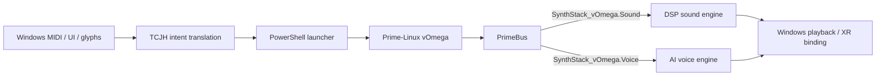

# KOS-Prime Synthesizer Stack vOmega

## Hybrid AI Sound and Voice Synthesis Model

The Synthesizer Stack is the audio and voice layer above PrimeBus. It spans Windows and Prime-Linux vOmega (WSL2), accepts packet-driven control, and returns rendered audio or metadata for playback, logging, and XR binding.

This document is an implementation contract. It does not imply that a DSP, MIDI host, or text-to-speech engine is currently installed in this repository.

## Stack Layers

### Audio engine

The Prime-Linux execution layer may host subtractive, FM, wavetable, and granular synthesis engines. Windows can provide Bluetooth-MIDI, USB-MIDI, virtual MIDI, UI, and environment input. TCJH translates those inputs into PrimeBus packets; the audio engine must not bypass PrimeBus for control decisions.

### AI voice engine

The voice layer converts text packets into voiced audio using a local or remote model. Voice profiles are `Narrator`, `System`, `Character`, and `Ambient`. Prosody fields are `tone`, `tempo`, `emotion`, and `space_context`.

## Packet Contracts

All packets retain the common `bus`, `packet_type`, and `ontology_segment` envelope fields. The packet type is `lattice`; the ontology segment distinguishes sound from voice.

### `sound.lattice`

Ontology segment: `SynthStack_vOmega.Sound`

| Field | Type | Required | Values or purpose |
| --- | --- | --- | --- |
| `instrument` | string | yes | `pad`, `bass`, `lead`, `fx`, or `drone`. |
| `env_context` | string | yes | `ShipCore`, `STAR-MESH`, `Cockpit`, or `Exterior`. |
| `params.attack` | number | no | Attack time or normalized envelope value. |
| `params.decay` | number | no | Decay time or normalized envelope value. |
| `params.sustain` | number | no | Sustain level. |
| `params.release` | number | no | Release time or normalized envelope value. |
| `params.filter_cutoff` | number | no | Filter cutoff control. |
| `params.resonance` | number | no | Filter resonance control. |
| `params.mod_matrix` | object | no | LFO, envelope, and macro assignments. |

### `voice.lattice`

Ontology segment: `SynthStack_vOmega.Voice`

| Field | Type | Required | Values or purpose |
| --- | --- | --- | --- |
| `voice_profile` | string | yes | `Narrator`, `System`, `Character`, or `Ambient`. |
| `text` | string | yes | Narration, dialogue, or system message. |
| `prosody.tone` | string | no | `neutral`, `calm`, `urgent`, or `mystic`. |
| `prosody.tempo` | number or string | no | Numeric tempo or an engine-defined tempo name. |
| `prosody.emotion` | string | no | `none`, `hopeful`, `tense`, or `reassuring`. |
| `prosody.space_context` | string | no | XR acoustic context such as cockpit or exterior. |

## Cross-Platform Flow

The existing `Invoke-KOSPrimeWsl.ps1` launcher is the host-to-WSL execution path. STAR-MESH may transport synthesis packets between nodes, but PrimeBus remains responsible for ontology validation and module routing.

## Core Integration

- ShipCore requests ambient soundscapes and engine tones through `sound.lattice`.
- STAR-MESH requests comms voices and telemetry narration through `voice.lattice`.
- CognitiveEngine generates dynamic narration from system state and routes it through the voice layer.
- GenesisOutput emits final mixed audio scenes, mission briefings, cockpit ambience, or synthesis metadata.
- ReclusionMemory records packet correlation, selected profile, synthesis status, and output metadata without storing sensitive voice content by default.

## Contract Rules

- Reject a synthesis packet with an unknown ontology segment, instrument, environment, voice profile, tone, or emotion.
- Keep audio and voice engines behind PrimeBus adapters; do not create direct module-to-module calls.
- Include a correlation identifier when a request produces asynchronous audio, voice, XR, or telemetry output.
- Treat rendered audio as an artifact reference or stream metadata at the PrimeBus boundary; transport implementations decide how bytes are delivered.
- Keep model selection, API keys, and local device paths outside committed packet payloads.