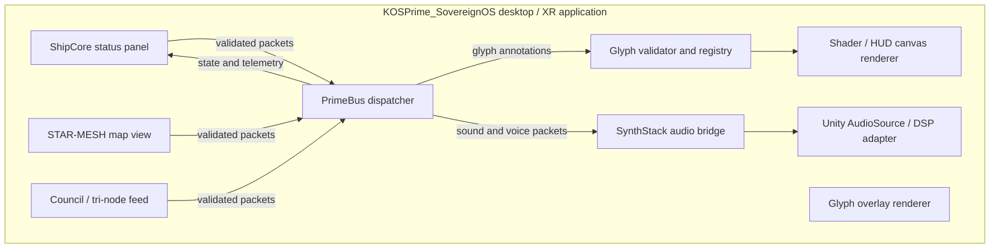

# Sovereign OS Unity Cockpit

Version: `1.0.0`

The Unity cockpit is the desktop/XR presentation layer for Sovereign OS. It binds PrimeBus contracts to status panels, STAR-MESH visualization, glyph overlays, the tri-node feed, and SynthStack audio without moving routing logic into the UI.

Framework selection and device adapter guidance are defined in [XR Framework Support](xr-frameworks.md). New Unity work should prefer OpenXR, XR Interaction Toolkit, and the Input System, with vendor SDKs isolated behind adapters.

## Scene layout

```text
Assets/
  Scenes/
    SovereignOS_Bridge.unity
  Prefabs/
    CockpitTerminal.prefab
    StarMeshViewer.prefab
    GlyphOverlayCanvas.prefab
    CouncilFeed.prefab
  Scripts/
    Core/
      PrimeBusUnityBridge.cs
      GlyphAnnotationRenderer.cs
    Synth/
      SynthStackAudioAdapter.cs
    UI/
      ShipCoreDashboard.cs
      CouncilFeedController.cs
```

## Runtime architecture



## Binding responsibilities

| Unity surface | Consumes | PrimeBus boundary |
| --- | --- | --- |
| ShipCore status panel | `module.state`, `module.health`, `xr-frame` | Read-only subscription; no direct module calls. |
| STAR-MESH map | Transport node and peer telemetry | Publishes user selection as a validated command. |
| Glyph overlay | Registered glyph annotations | Validates family, context, and governance before rendering. |
| Council feed | CognitiveEngine, ReclusionMemory, GenesisOutput state | Displays correlated events and policy output. |
| SynthStack adapter | `SynthStack_vOmega.Sound`, `SynthStack_vOmega.Voice` | Validates profile and environment before audio playback. |

## Unity bridge contract

The Unity project should reference the compiled KOS-Prime core assembly and keep Unity-specific code in its own project. A bridge should own a process-local sequence counter, subscribe to PrimeBus, and marshal callbacks to Unity's main thread before touching UI objects.

```csharp
public sealed class PrimeBusUnityBridge : MonoBehaviour
{
    private IPrimeBus _bus;
    private long _sequence;

    public void DispatchPlayerCommand(string intent)
    {
        var packet = new PacketEnvelope
        {
            Source = ModuleId.CognitiveEngine,
            Destination = ModuleId.QuantumCrystals,
            Type = PacketType.Command,
            SequenceNumber = Interlocked.Increment(ref _sequence),
            Payload = new Dictionary<string, object?> { ["Intent"] = intent }
        };

        _bus.Publish(packet);
    }
}
```

This is a Unity-side skeleton and is not compiled by the current backend solution. UI subscriptions must not mutate Unity objects from a worker thread. The bridge must also dispose subscriptions during `OnDestroy`.

## Governance and safety

- UI commands are proposals until the applicable `KOSPrime.M3tG1r.MultimodalGovernance` confirmation is present.
- Camera attention and glyphs never authorize commands.
- Glyph rendering is stateless and does not retain camera frames or audio.
- Audio playback can be muted independently from text and UI output.
- PrimeBus validates packet ontology, endpoints, and sequence ordering before dispatch.
- Unity prefabs are presentation concerns; state, routing, and policy remain in the core contracts.